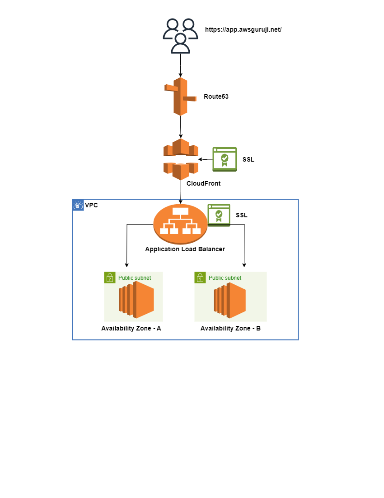

# Host Simple Website Using EC2 Instance With Load Balancer & CloudFront

> Requirements
  - Host Simple Website Using EC2 Instance With Load Balancer & CloudFront
  - Create Application Load Balancer With SSL Certificate
  - Create CloudFront For Load Balancer
  - Make a DNS Entry In Route53 For web.awsguruji.net
  - Configure Additional Domain Name With SSL
  - Application URL Should Be https://web.awsguruji.net

# How To Achieve These Requirements?
  - Create EC2 Instance With 8 GB Storage, Linux OS With Nginx Web Server
  - Install Nginx Web Server By Using User Data Script
  - Create Application Load Balancer With Additional Security Group
  - Open HTTPS Port Publically
  - Create CloudFront With Load Balancer
  - CDK Code - Typescript
  - Architecture Diagram

  

 # CDK Code To Create Tech Stack
 >  **If you don't know CDK - Follow this playlist** https://www.youtube.com/playlist?list=PLqdbsgoG9hwWYlNvMJmt6rLQXaM6MoEAh

 - Find below CDK Code For This Setup

**GitHub Repo:** https://github.com/namdev-rathod/website-hosting-with-s3-cloudfront.git

**Note:** Change the values whereever possible based on your environments.