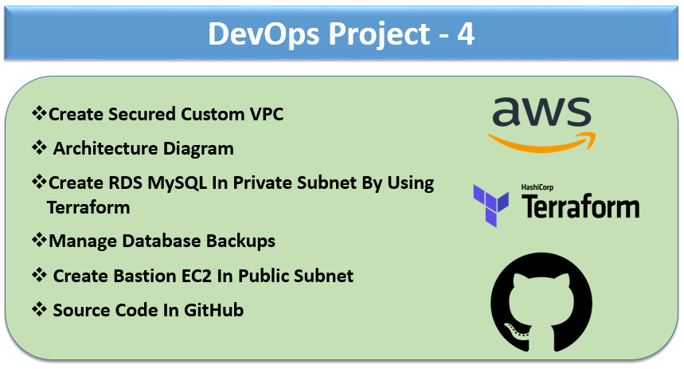

# How To Connect RDS Database Securely By Using Bastion Server

- **Requirements**
    - Create Custom VPC With Private and Public Subnet
    - Create Bastion Server In Public Subnet
    - Create RDS MySQL Database In Private Subnet
    - Make Sure Database Should Not Be Public Accessible
    - Open MySQL Port For Only Private Subnet & Bastion Server
    - Try To Connect Database From Bastion Server Securely
    - Install Telnet & MySQL Client To Check MySQL Connectivity From Bastion Server

- **On Bastion Server**

```
              sudo yum install telnet
              sudo yum install -y https://dev.mysql.com/get/mysql57-community-release-el7-11.noarch.rpm
              sudo yum install -y mysql-community-client
              rpm --import https://repo.mysql.com/RPM-GPG-KEY-mysql-2022

```

- **Architeccture Diagram**




- **DevOps Project - 4 Terraform Code**

```
provider "aws" {
  region = "ap-south-1" # Replace with your desired AWS region
}

resource "aws_vpc" "my_vpc" {
  cidr_block = "10.0.0.0/16" #Replace VPC CIDR Block With Project Specific IP range
  enable_dns_support = true
  enable_dns_hostnames = true
  tags = {
    Name = "my-vpc"
  }
}

resource "aws_subnet" "public_subnet" {
  vpc_id                  = aws_vpc.my_vpc.id
  cidr_block              = "10.0.1.0/24"
  availability_zone       = "ap-south-1a" # Replace AZ as per your requirements
  map_public_ip_on_launch = true
  tags = {
    Name = "public-subnet"
  }
}

resource "aws_subnet" "private_subnet" {
  vpc_id                  = aws_vpc.my_vpc.id
  cidr_block              = "10.0.2.0/24" 
  availability_zone       = "ap-south-1b" # Replace AZ as per your requirements
  tags = {
    Name = "private-subnet"
  }
}

resource "aws_route_table" "public_route_table" {
  vpc_id = aws_vpc.my_vpc.id
  route {
    cidr_block = "0.0.0.0/0"
    gateway_id = aws_internet_gateway.my_igw.id
  }
  tags = {
    Name = "public-route-table"
  }
}

resource "aws_route_table" "private_route_table" {
  vpc_id = aws_vpc.my_vpc.id
  tags = {
    Name = "private-route-table"
  }
}

resource "aws_route_table_association" "public_subnet_association" {
  subnet_id      = aws_subnet.public_subnet.id
  route_table_id = aws_route_table.public_route_table.id
}

resource "aws_route_table_association" "private_subnet_association" {
  subnet_id      = aws_subnet.private_subnet.id
  route_table_id = aws_route_table.private_route_table.id
}

resource "aws_internet_gateway" "my_igw" {
  vpc_id = aws_vpc.my_vpc.id
}

output "public_subnet_id" {
  value = aws_subnet.public_subnet.id
}

output "private_subnet_id" {
  value = aws_subnet.private_subnet.id
}

resource "aws_db_subnet_group" "my_db_subnet_group" {
  name       = "my-db-subnet-group"
  subnet_ids = [aws_subnet.private_subnet.id, aws_subnet.public_subnet.id]
}

variable "key_pair_name" {
  type    = string
  default = "AWS-EC2-Test-Server-Key" # Replace key pair 
}

# Create EC2 instance
resource "aws_instance" "terraform_ec2_instance" {
  ami           = "ami-05552d2dcf89c9b24" # Replace with your desired Linux AMI ID
  instance_type = "t3.micro"
  key_name      = var.key_pair_name
  vpc_security_group_ids = [aws_security_group.my_ec2_security_group.id]
  subnet_id              = aws_subnet.public_subnet.id

    user_data = <<-EOF
              #!/bin/bash
              sudo yum update -y
              sudo yum install -y nginx
              echo "<html><body><h1><b>Hello, This is a Bastion Server World!</b></h1></body></html>" > /usr/share/nginx/html/index.html
              sudo service nginx start
              EOF

  tags = {
    Name = "Bastion-EC2-Public" # Replace EC2 name as per your choice
  }
}


# Create RDS In Private Subnet
resource "aws_db_instance" "my_db_instance" {
  identifier           = "my-db-instance"
  allocated_storage    = 30
  storage_type         = "gp2"
  engine               = "mysql"
  engine_version       = "8.0"
  instance_class       = "db.t3.small"
  username             = "admin"
  password             = random_password.my_db_password.result
  db_subnet_group_name = aws_db_subnet_group.my_db_subnet_group.name
  vpc_security_group_ids = [aws_security_group.my_db_security_group.id]
  publicly_accessible  = false
  multi_az             = true
  skip_final_snapshot  = true
  backup_retention_period = 2
  apply_immediately    = true

  # Other optional configurations can be added here

  tags = {
    Name = "my-db-instance"
  }
}

resource "random_password" "my_db_password" {
  length           = 16
  special          = true
  override_special = "_%@"
}

resource "aws_secretsmanager_secret" "my_db_secret" {
  name = "rds-demo-db-secrets"
}

resource "aws_secretsmanager_secret_version" "my_db_secret_version" {
  secret_id     = aws_secretsmanager_secret.my_db_secret.id
  secret_string = jsonencode({
    username = "admin",
    password = random_password.my_db_password.result
  })
}

resource "aws_db_parameter_group" "my_db_parameter_group" {
  name        = "demo-db-parameter-group"
  family      = "mysql8.0"
  description = "Custom parameter group for MySQL 8.0"

}

# Security Group For RDS
resource "aws_security_group" "my_db_security_group" {
  name        = "my-db-security-group"
  description = "Security group for MySQL RDS instance"
  vpc_id      = aws_vpc.my_vpc.id

  ingress {
    from_port   = 3306
    to_port     = 3306
    protocol    = "tcp"
    cidr_blocks = [aws_subnet.private_subnet.cidr_block]
  }

  ingress {
    from_port   = 3306
    to_port     = 3306
    protocol    = "tcp"
    cidr_blocks = [aws_subnet.public_subnet.cidr_block]
  }

    ingress {
    from_port   = 22
    to_port     = 22
    protocol    = "tcp"
    cidr_blocks = ["0.0.0.0/0"]
  }

  egress {
    from_port   = 0
    to_port     = 0
    protocol    = "-1"
    cidr_blocks = ["10.0.0.0/16"]
  }
}


# Security Group For EC2
resource "aws_security_group" "my_ec2_security_group" {
  name        = "my-ec2-security-group"
  description = "Security group for Bastion EC2 instance"
  vpc_id      = aws_vpc.my_vpc.id

    ingress {
    from_port   = 22
    to_port     = 22
    protocol    = "tcp"
    cidr_blocks = ["0.0.0.0/0"]
  }

    ingress {
    from_port   = 80
    to_port     = 80
    protocol    = "tcp"
    cidr_blocks = ["0.0.0.0/0"]
  }


  egress {
    from_port   = 0
    to_port     = 0
    protocol    = "-1"
    cidr_blocks = ["0.0.0.0/0"]
  }
}


```

- **Run Terraform Commands To Create Resources**

```

terraform init
terraform plan
terraform apply

```