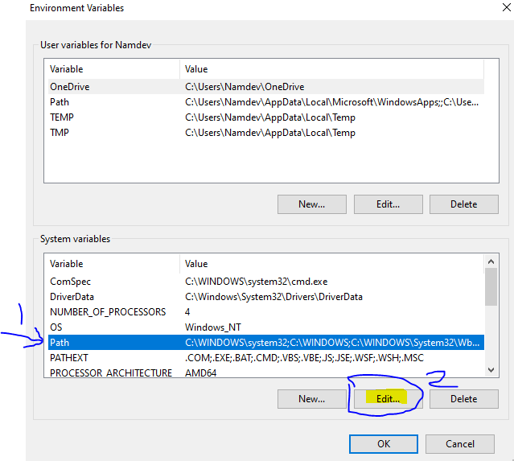
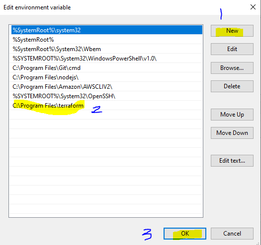
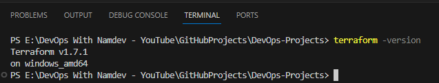

# How To Setup Terraform Project On Local Windows Machine
- Pre-requisites
    - Install AWS CLI - https://awscli.amazonaws.com/AWSCLIV2.msi
    - Install Terraform - https://developer.hashicorp.com/terraform/install Its depend on OS type
    - AWS IAM User Credentials
    
- For Linux

```
sudo yum install -y yum-utils
sudo yum-config-manager --add-repo https://rpm.releases.hashicorp.com/RHEL/hashicorp.repo
sudo yum -y install terraform

```
- For Mac

```
brew tap hashicorp/tap
brew install hashicorp/tap/terraform

```

- For Windows https://releases.hashicorp.com/terraform/1.7.1/terraform_1.7.1_windows_amd64.zip
- extract it on download folder
- Copy terraform folder into C:\Program Files\terraform
- It should looks like below


- Open Control Panel
- Click On System


- Click On Advanced System Setting


- Click On Environment Variables


- Click On Path & Select Edit



- Clink On New & Add Terraform Path C:\Program Files\terraform



- Click Ok --> Ok --> Ok
- Check terraform version with command 

```
terraform -version
```



